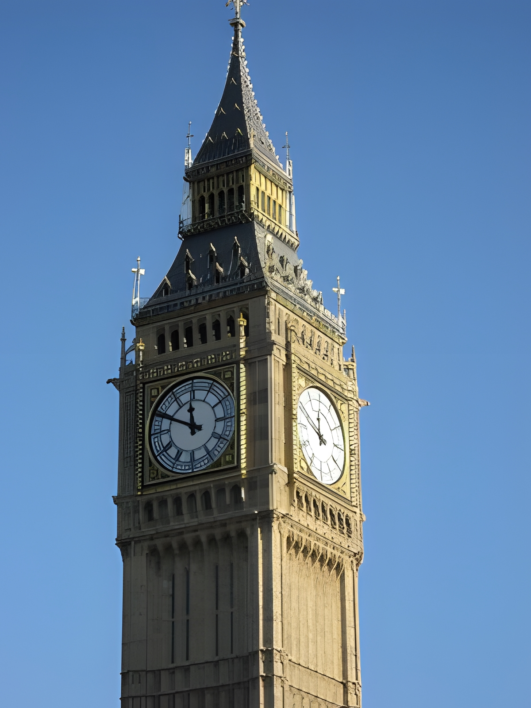

# LetterArt
A tool to make art out of a memorable image and a great backstory.

## Install

`pip install git+https://github.com/sebastiankulla/letterart`

## Usage

It's best to create a new folder for each of your projects. It must contain the image and a text file that you want to use accordingly.
You also need to create a config file in which further settings can be made. This must be a json file. 
The config file must contain at least the path to the image and the text. But you can also make other settings, such as the font size used or the spacing and horizontal and vertical alignment between the individual letters.
The config file can look like the following:

```json
{
  "picture_dimension_x_mm": 200,
  "picture_dimension_y_mm": 200,
  "svg_scaling": 400,
  "padding_x_mm": 10,
  "padding_y_mm": 10,
  "space_x": 80,
  "space_y": 800,
  "backspace": 100,
  "img_pixel_per_mm": 1,
  "contrast_enhance": 1.5,
  "max_stroke_width": 100,
  "min_stroke_width": 20,
  "mode": "color",
  "picture_name": "bild1.jpeg",
  "text_file_name": "text.txt",
  "font": "test_font.ttf",
  "background_color": "black"
}

```

After that run following script for the conversion.
At the moment the tool only accepts *.svg export of your result.

```python
from letterart import Converter, Config, extract_alphabet, Mode


config_path = r'./projects/my_project/config.json'

config = Config(config_path)
converter = Converter(config)
converter.save_file('its_art_now.svg')

```

## Results
### Original Image



### Mode Fill


### Mode Grayscale

### Mode Color
