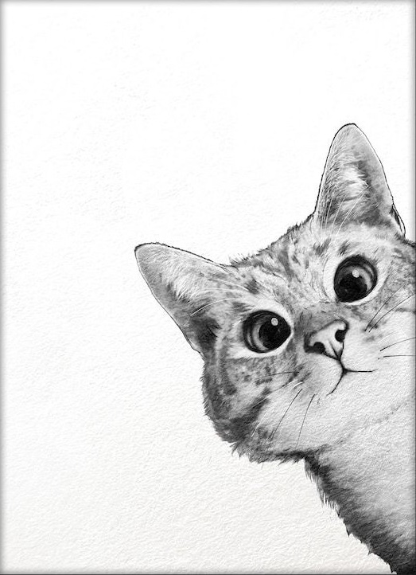
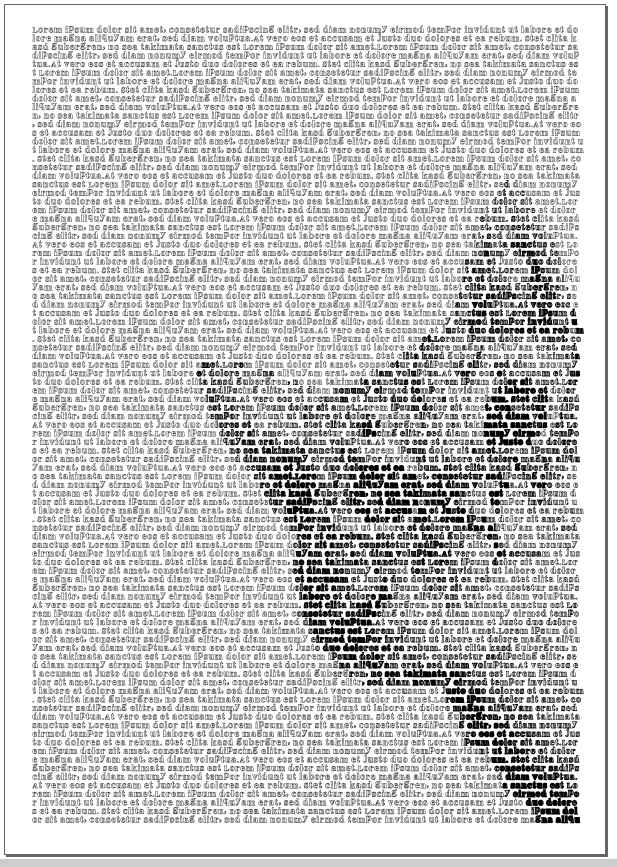

# LetterArt
A tool to make art out of a memorable image and a great backstory.

## Install

`pip install git+https://github.com/sebastiankulla/letterart`

## Usage
You need your text in a *.txt file and an image in *.jpg format.
After that run following script for conversion.
At the moment the tool only accepts *.svg export of your result.

```python
from letterart import Converter, Config

path_to_text = r'./some_text.txt'
path_to_image = r'./cat.jpg'

config = Config()
converter = Converter(path_to_image, path_to_text, config )
converter.save_file('its_art_now.svg')
```

## Results




